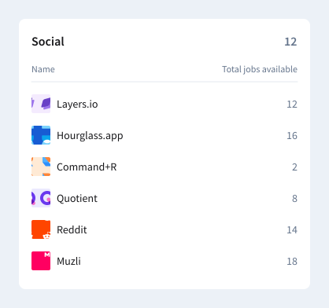

# Frontend React Assessment

Welcome to the live coding test for the Frontend React Developer position. This assignment is designed to evaluate your skills in frontend development.

This technical test aims to assess the following skills:

1. Your ability to fluently utilize the React library or the Next.js framework (preferred 😉).
2. Your ability to structure the codebase by applying best practices.
3. Your ability to work with the provided mockup and build the UI with precision.

## What We’re Looking For

We will evaluate your submission based on the following criteria:

- Code readability and maintainability.
- Adherence to design specifications.
- Responsiveness and performance optimization.
- Error handling and robustness.
- Implementation of scalable solutions for handling data.

## Backend API

- [ ] Use this API endpoint: [API endpoint](https://fs-industry-card.onrender.com/api/companies).

  The API returns an array of company objects with the following structure:

  ```json
  [
    {
      "id": 1,
      "name": "Company A",
      "industry": "Industry X"
    },
    {
      "id": 2,
      "name": "Company B",
      "industry": "Industry Y"
    },
    {
      "id": 3,
      "name": "Company C",
      "industry": "Industry X"
    }
  ]
``

### Frontend Implementation

- [ ] Fetch the companies' data from the API.
- [ ] The card's title should be the industry name.
- [ ] Display the count of companies in that industry at the top right corner of the card.
- [ ] Implement the company grouping logic by industry on the frontend. Ensure that your implementation is optimized for scalability, particularly in handling large datasets.
- [ ] Use [Tailwind CSS](https://tailwindcss.com/) to implement the card design. Refer to the [Figma file](https://www.figma.com/design/9GvGhDV1Te6bQzS1GLoj8J/Dealroom-FE-Assessment?node-id=0%3A1&t=I6Ph4vb2EAvbkQQ7-1) for design specifications.




---

Good luck with your assignment! Have fun!
